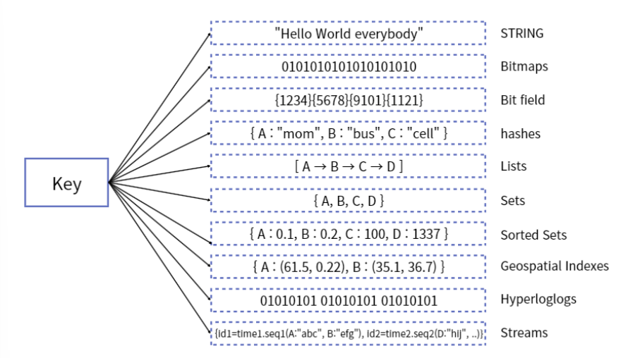

# Redis

Redis는 메모리 기반의 데이터 저장소이다.(In-Momory DB) 키-벨류 데이터 구조를 기반한 다양한형태의 자료 구조를 제공하며, 데이터들을 저장할 수 있는 저장소이다.

- In-Memory 데이터 구조를 가진 저장소
- DB, Cache, Message Queue, Shared Memory 용도로 사용
- **웹 서버의 부담을 줄이고, 고속으로 데이터 제공이 가능**

## 인메모리 (In-Memory)
- 컴퓨터의 주기억장치인 RAM에 데이터를 올려서 사용하는 방법
- RAM에 데이터를 저장학 되면 메모리 내부에서 처리가 되므로 데이터르 저장/조회할 때 하드디스크를 오고가는 과정을 거치지 않아도 되어 속도가 빠름

👉 그러나 서버의 메모리 용량을 초과하는 데이터를 처리할 경우, RAM의 특성인 **휘발성**에 따라 **데이터가 유실**될 수 있음

#### 휘발성
- 전원이 꺼지면 가지고 이는 데이터가 사라지는 특성

## 기존 DB가 있지만 Redis를 사용하는 이유는??
- DB는 데이터를 디스크에 직접 저장(write)하기 때문에 서버에 문제가 발생하여 다운되더라도 데이터가 손실되지 않음
- 매번 디스크에 접근해야하기 때문에 사용자가 많이질수록 부하가 많아지고 느려질 수 있음
- 따라서 캐시 **서버를 도입하여 사용하는데 이것이 Redis**

👉 같은 요청이 여러 번 들어올 때 Redis를 사용함으로써 매번DB를 거치지 않고 캐시 서버에서 저장해놨던 값을 바로 가져와 **DB의 부하를 줄이고 서비스 속도도 느려지지 않게** 할 수 있다.

# Redis의 특징
- Key, Value 구조
- 빠른 처리 속도
  - 디스크가 아닌 메모리에서 데이터를 처리하기 때문에 속도가 빠름
- Data Type(Collection)을 지원
  - 개발의 편의성, 생산성이 좋아지고 난이도가 낮아짐

 
👉 Redis에서 제공하는 **Sorted-Set**자료구조를 사용하면 좀 더 빠르고 간단하게 데이터 정렬가능

## AOF, RDB 방식
- 인메모리 데이터 저장소가 가지는 휘발성의 특성으로 데이터가 유실될 경우를 방지하여 백업 기븡을 제공

### AOP (Append On File) 방식
- Redis의 모든 write/update 연산 자체를 모두 log 파일에 기록하는 형태

### RDB (Snapshotting) 방식
- 순간적으로 메모리에 있는 내용 전체를 디스크에 담아 여구 저장하는 방식

### Redis Sentinel 및 Redis Cluster를 통한 자동 파티셔닝을 제공
- Master와 Slaves로 구성하여 여러대의 복제본을 만들수 있고, 여러대의 서버로 읽기를 확장 가능

 

